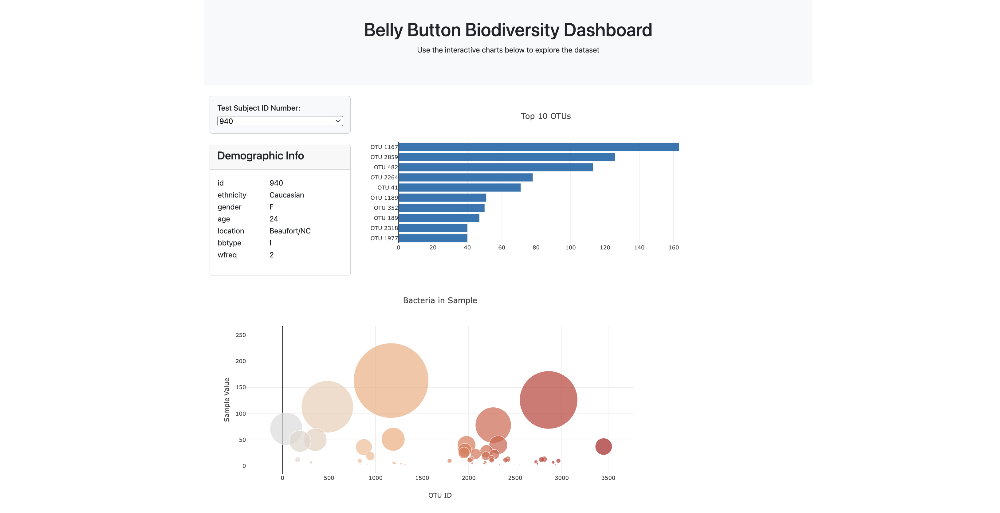

# Belly Button Challenge 

## Website: 
[website](https://mattcat1221.github.io/BellyButton_Analysis/)

## Description
In this assignment, I built an interactive dashboard to explore the Belly Button Biodiversity dataset. It was fascinating because this dataset cataloged the microbial communities residing in human navels. What stood out to me was that a small group of microbial species, referred to as operational taxonomic units (OTUs), were found in more than 70% of individuals, while the rest were relatively uncommon. This emphasized the diversity and distribution of microbes in a seemingly small and overlooked part of our bodies.

## Table of Contents
- [Installation](#installation)
- [Usage](#usage)
- [Credits](#credits)
- [License](#license)
- [Features](#features)

- [Contact](#contact)

## Installation
D3 library, plotly, HTML, JavaScript, Bootstrap

## Usage
Data Analysis

## Credits
Casey Matthews 

## License
MIT

## Features
interactive bubble charts, dropdown menus and bar charts.

## Contact
If there are any questions of concerns, I can be reached at:
##### [github: mattcat1221](https://github.com/mattcat1221)
##### [email: caseyvmatthews@gmail.com](mailto:caseyvmatthews@gmail.com)
